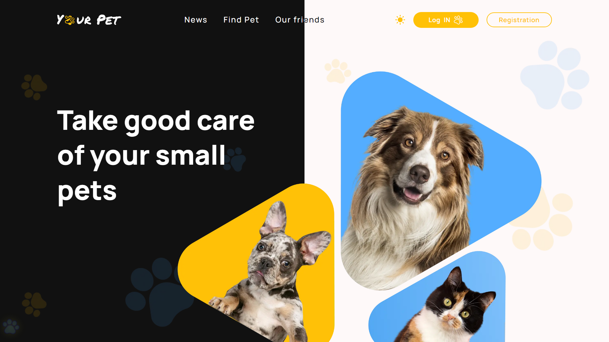

# 
Ласкаво просимо до "Your Pet" - домівки для лапочок! 🐾

## 
Про "Your Pet"

`Your Pet` - це веб-сервіс, створений з метою допомогти вам знайти свого
домашнього улюбленця, який стане вашою справжньою душею. Ви можете створити свій
особистий обліковий запис, розмістити оголошення про продаж або усиновлення
тварини або ж знайти нового друга для вашої сім'ї.

## 
Особливості сервісу

- Інтуїтивний та зручний інтерфейс, що дозволяє швидко знаходити та переглядати
  інформацію про тварин.
- Вибір світлої або темної теми інтерфейсу, щоб створити комфортні умови для
  користувача.
- Підтримка інтернаціоналізації мов - ви можете користуватись сервісом
  українською або англійською мовою.

## 
Як користуватись "Your Pet"?

1. Зареєструйтеся або увійдіть в свій обліковий запис.
   - Через сам сайт - Ви можете створити обліковий запис на нашому сайті,
     заповнивши необхідні поля форми реєстрації.
   - Через обліковий запис Google - Ви можете скористатися своїм обліковим
     записом Google для швидкої реєстрації.
2. Перегляньте список домашніх улюбленців для продажу або усиновлення.
3. Додайте своїх улюбленців до списку, щоб легко знаходити їх інформацію.
4. Знаходьте цікаві новини про тварин.

## 
Стек технологій

"Your Pet" використовує сучасні технології та бібліотеки для створення зручного
та функціонального веб-додатку. Ось ключові технології, які використовуються в
проєкті:

- `React`: Фреймворк для побудови інтерфейсу користувача.
  - `React Router DOM`: Бібліотека для навігації між сторінками додатку.
  - `React Paginate`: Бібліотека для розділення контенту на сторінки.
  - `React Toastify`: Бібліотека для виведення сповіщень користувачу.
  - `React Toggle Dark Mode`: Бібліотека для переключення між світлою та темною
    темами.
- `Redux Toolkit`: Інструментарій для управління станом додатку.
- `Redux Persist`: Бібліотека для збереження стану Redux у локальному сховищі.
- `Styled Components`: Бібліотека для стилізації компонентів з використанням CSS
  в JavaScript.
- `Axios`: Бібліотека для здійснення HTTP-запитів.
- `Formik`: Бібліотека для керування формами та їх валідації.
- `i18next`: Бібліотека для локалізації та інтернаціоналізації додатку.
- `Yup`: Бібліотека для валідації даних в схемах.

---

### 
"Your Pet" - місце, де ласка та дружба - найкращі умови для усіх. 🐶🐱💕

